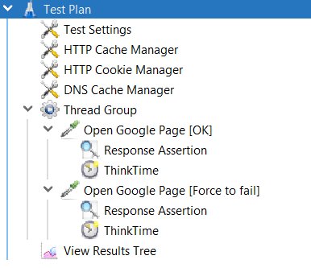

# JMeter response validator

## Description
The plugin provides the possible to validate the response code and body. The details of the failed request:

* Sampler name
* URL
* Request data
* Response code with headers and body
* Error details

The details can be saved to external system or to the file on the disc. The idea is to have the output which can be addressed to DEV team for the analysis. 

## Compatibility
The supported versions:
* Java 8
* JMeter 5.4.1 and upper 

## Installation 
Put file `jmeter-plugins-mdqa-response-validator-x.x.jar` to `~\apache-jmeter-x.x.x\lib\ext`

## Example of the usage
Add JSR223 Assertion with the following code:
~~~~
import mdqa.jmeter.response.validator.*
import mdqa.jmeter.response.validator.models.*
import mdqa.jmeter.response.validator.helpers.*

TestContext testContext = new TestContext(ctx)

ResponseValidator responseValidator = new ResponseValidator()
.thisResponse(testContext.getResponse())
.shouldHaveCode("200")
.shouldContainText("Test")
.shouldContainValuesWithOrLogic("Test11","Boolean")

if (responseValidator.isValid() == false)
{		     
AssertionResult.setFailure(true)
AssertionResult.setFailureMessage(responseValidator.getValidationMessage())

      String csvRow = new CSVRowBuilder(testContext)
					.setSeparator("|")
					.putRequest()
					.putResponse()
					.putErrorMessage(responseValidator.getValidationMessage())
					.getRow()
			
	Logger logger = new CsvLogger()
	                // checks whether the validation is enabled using JMeter variable
			logger.isEnabled(vars.get("LogIsEnabled").toBoolean())
			// gets file path from variable
			logger.setFilePath(vars.get("LogPath").toString())
			// replaces the chars to have single line
			logger.saveMessage(csvRow.replace("\n", "").replace("\r", ""))	 

}
~~~~

## CSV file caption
This version of the plugin does not write caption for CSV file. You can add it manually, for example for the code like bellow:

~~~~
String csvRow = new CSVRowBuilder(testContext)
.setSeparator("|")
.putRequest()
.putResponse()
.putErrorMessage(responseValidator.getValidationMessage())
.getRow()
~~~~

You can use the CSV file caption
~~~~
request.name|request.url|request.headers|request.body|response.code|response.headers|response.body|error
~~~~
The programming code can be used as well to put it, depends on the contract of the row.

## Text Plan example
The example of the code usage

To download the JMeter test plan click [here](https://minhaskamal.github.io/DownGit/#/home?url=https://github.com/mderevyankoaqa/jmeter_response_validator/blob/dev/etc/mdqa.jmeter.response.validator.example.jmx)

## Recommendation
Please be careful with Virtual Users settings. This plugin is supposed to be used while smoke/functional tests with low load (1-10 users). The physical disc can be overloaded on the JMeter server while load tests if you have a loot of errors (you can accept the risk and try to use it while load test, but you need to monitor that JMeter works well).